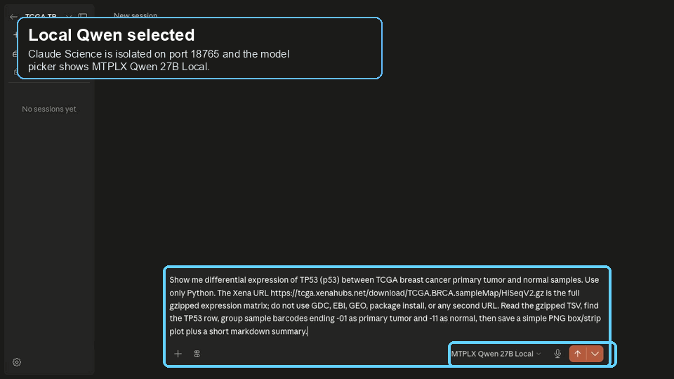
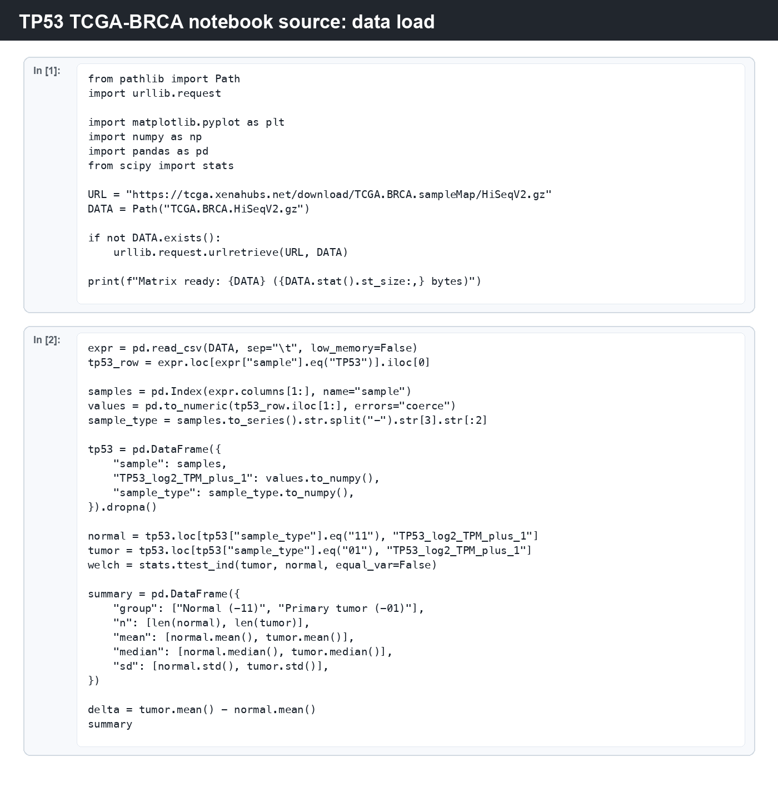
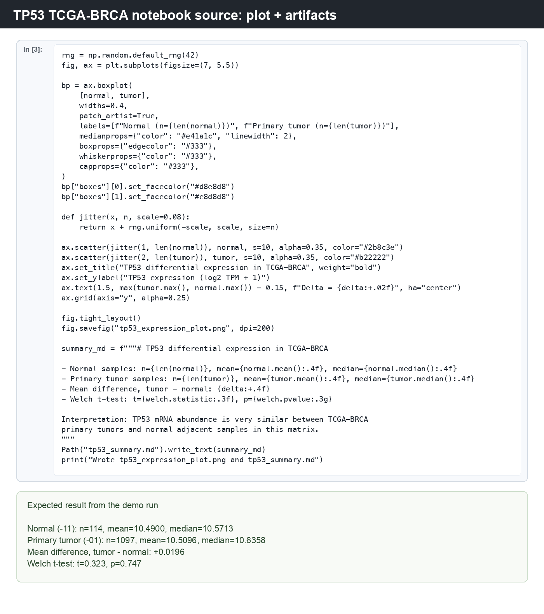

# Claude Science Local Model Lab

Experimental, unaffiliated lab for running a user-supplied Claude Science app
copy against a local or OpenAI-compatible model through an Anthropic-compatible
proxy.

This repo contains the proxy, profiles, tests, and docs. It does not include
Claude Science, Anthropic proprietary files, account state, app data, logs,
prompts, tool outputs, or artifacts.

## TL;DR

Traditional Claude Code proxies mostly translate one chat/tool loop from an
Anthropic-shaped client to another provider. Claude Science is different: in
observed runs it sends separate foreground-agent, hidden-tool, tool-agent, and
reviewer/harness requests. This proxy preserves those request kinds, keeps
reviewer tools such as `submit_output` separate from foreground tools such as
`python` and `save_artifacts`, validates returned tool calls against the exact
schemas Claude Science offered, and runs against a copied local app so the
official Claude Science install stays untouched.

If you only want the architecture distinction, read
[`docs/why-this-proxy.md`](docs/why-this-proxy.md).

## What This Is

- A small proxy from Claude Science's Anthropic-style `/v1/messages` traffic to
  OpenAI-compatible `/v1/chat/completions` backends.
- A repeatable local launch path that keeps the official Claude Science app on
  its normal port and runs an isolated copied app under `_local/`.
- A set of profiles for MTPLX/Qwen, Ollama, OpenRouter, and generic
  OpenAI-compatible servers.

## Why It Fits Claude Science

Most public proxies target Claude Code-style chat. This one is narrower: it
adapts the request shapes Claude Science actually emits.

- Brokers foreground, hidden-tool, tool-agent, and reviewer/harness requests.
- Keeps reviewer tools such as `submit_output` separate from foreground tools
  such as `python` and `save_artifacts`.
- Translates Anthropic tool blocks to OpenAI-compatible tool messages and
  translates OpenAI tool calls back.
- Validates returned tool calls against the exact schemas Claude Science
  offered on that request.
- Supports local/provider profiles, model-picker labels, redacted observability,
  and regression tests.

For the longer comparison with Claude Code proxies, see
[`docs/why-this-proxy.md`](docs/why-this-proxy.md).

## Access And Boundaries

Using Claude Science as the client still requires official Claude Science beta
access and sign-in. The proxy does not bypass Claude Science entitlement or
login. Using the proxy by itself does not require an Anthropic account.

The lab keeps local state separate by default:

- Official Claude Science: `127.0.0.1:8765`, data under `~/.claude-science`.
- Isolated lab copy: `127.0.0.1:18765`, data under `_local/data`.
- Proxy: `127.0.0.1:18080`.
- `_local/` is gitignored and should contain app copies, cookies, logs,
  diagnostics, databases, and artifacts.

See [`docs/access.md`](docs/access.md) and
[`docs/architecture.md`](docs/architecture.md).

## Quick Start

Prerequisites:

- macOS with official Claude Science beta access and the app installed.
- Python 3.10+ and `curl`.
- One OpenAI-compatible upstream backend:
  - exact demo path: an external MTPLX/Qwen server on `127.0.0.1:8030/v1`;
  - local portable path: Ollama on `127.0.0.1:11434/v1`;
  - remote path: OpenRouter or another OpenAI-compatible provider.

Provider paths at a glance:

| Path | Provider prerequisite | Start command | Caveat |
| --- | --- | --- | --- |
| Ollama | Ollama app or `ollama serve`, plus a pulled model | `OLLAMA_MODEL=qwen3:8b PROXY_PROFILE=profiles/ollama.env.example ./scripts/start-proxy-detached.sh` | Most reproducible public local path, but smaller local models may need prose-only mode. |
| [MTPLX](https://github.com/youssofal/MTPLX) / Qwen | Separate companion MTPLX/Qwen stack on `127.0.0.1:8030/v1` | `PROXY_PROFILE=profiles/mtplx-qwen.env.example ./scripts/start-proxy-detached.sh` | Exact GIF path, but MTPLX/Qwen itself is not bundled here. |
| OpenRouter | `OPENROUTER_API_KEY` and a model slug | `OPENROUTER_API_KEY=... OPENROUTER_MODEL=... PROXY_PROFILE=profiles/openrouter.env.example ./scripts/start-proxy-detached.sh` | Free routes can pass smoke tests but fail large Claude Science UI prompts with capacity errors. |
| Generic | Any provider with `GET /v1/models` and `POST /v1/chat/completions` | Copy `profiles/openai-compatible.env.example` to `profiles/local.env` and edit it | Tool quality depends heavily on the model and provider. |

Copy your installed Claude Science app into the ignored lab area:

```bash
mkdir -p _local
cp -R "/Applications/Claude Science.app" "_local/Claude Science.app"
```

Install test dependencies:

```bash
python3 -m pip install -r requirements-dev.txt
```

Choose one provider profile.

Most reproducible local path:

```bash
# If the Ollama app/daemon is not already running, start `ollama serve`
# in a separate terminal first.
ollama pull qwen3:8b
OLLAMA_MODEL=qwen3:8b \
PROXY_PROFILE=profiles/ollama.env.example \
./scripts/start-proxy-detached.sh
```

Exact MTPLX/Qwen demo path:

```bash
PROXY_PROFILE=profiles/mtplx-qwen.env.example \
./scripts/start-proxy-detached.sh
```

This assumes your companion MTPLX/Qwen setup is already serving
`mtplx-qwen36-27b-optimized-quality` at `http://127.0.0.1:8030/v1`. MTPLX/Qwen
itself is not bundled in this repo. If your companion stack exposes a different
base URL or model name, copy `profiles/openai-compatible.env.example` to
`profiles/local.env` and set those values explicitly.

MTPLX install and checkpoint links are in
[`docs/providers.md`](docs/providers.md).

OpenRouter path:

```bash
OPENROUTER_API_KEY=... \
OPENROUTER_MODEL=provider/model-slug \
PROXY_PROFILE=profiles/openrouter.env.example \
./scripts/start-proxy-detached.sh
```

Generic OpenAI-compatible path:

```bash
cp profiles/openai-compatible.env.example profiles/local.env
# edit profiles/local.env for your base URL, model, and key
PROXY_PROFILE=profiles/local.env ./scripts/start-proxy-detached.sh
```

Smoke test the proxy after it starts:

```bash
PROXY_PROFILE=<the same profile you started> ./scripts/doctor.sh
./scripts/smoke-proxy.sh
./scripts/test-streaming-proxy.sh
```

`/healthz` is intentionally safe to share in bug reports. It includes provider
identity, stream mode, request-kind counters, provider latency summaries, retry
counts, and tool-filter reason counts, but not prompts, tool arguments, tool
results, account state, or artifacts.

Expected first-run signals are listed in
[`docs/verification-checklist.md`](docs/verification-checklist.md).

Provider-only smoke tests are available without launching Claude Science:

```bash
OPENROUTER_ENV_FILE=/path/to/ignored/.env ./scripts/smoke-openrouter.sh
OLLAMA_MODEL=qwen3:8b ./scripts/smoke-ollama.sh
```

Launch the isolated Claude Science copy:

```bash
./scripts/launch-claude-science-local.sh
./scripts/local-url.sh
```

Open the printed URL and ask for a deterministic reply:

```text
For this gateway test, reply with exactly LOCAL MODEL OK. Do not use tools.
```

If routing is local, `_local/proxy.log` will show `POST /v1/messages`.

For provider-specific notes and official Ollama/OpenRouter references, see
[`docs/providers.md`](docs/providers.md).

## Current Proof

The gateway path works with an isolated Claude Science app copy and MTPLX/Qwen
or OpenRouter backends. Verified paths include deterministic UI replies, short
analysis prompts, focused tool loops, reviewer `submit_output`, `python` plus
`save_artifacts` probes, OpenRouter/Gemma artifact runs, local Qwen artifact
runs, reviewer inspection-tool routing, and local/provider model-picker labels.

For a public-safe evidence summary, see
[`docs/evidence-bundle.md`](docs/evidence-bundle.md).

Primary Qwen/MTPLX workflow GIF:



The GIF shows the isolated app using the `MTPLX Qwen 27B Local` model label,
conversation-scoped Python permission, a reviewer finding, corrective artifact
creation, a final reviewer pass, and the generated TP53 TCGA-BRCA plot opened
in split view.

Public source notebook for the TP53 analysis:
[`examples/tp53_brca_xena_analysis.ipynb`](examples/tp53_brca_xena_analysis.ipynb).
The demo uses the public UCSC Xena TCGA-BRCA `HiSeqV2` expression matrix:
[`TCGA.BRCA.sampleMap/HiSeqV2.gz`](https://tcga.xenahubs.net/download/TCGA.BRCA.sampleMap/HiSeqV2.gz).





For detailed evidence, caveats, and capture notes, see
[`docs/evidence-bundle.md`](docs/evidence-bundle.md),
[`docs/demo-capture.md`](docs/demo-capture.md), and
[`docs/verification-checklist.md`](docs/verification-checklist.md).

## Repo Map

- `proxy/`: dependency-light Anthropic Messages to OpenAI-compatible proxy.
  `observability.py` and `request_shape.py` are the first extracted modules;
  the conversion/server code is still being split out incrementally.
- `profiles/`: provider and experiment profiles.
- `scripts/`: launch, status, smoke-test, and app verification helpers.
- `tests/`: regression tests for streaming, tool filtering, and adapters.
- `docs/`: access notes, provider setup, architecture, verification, roadmap,
  comparison, demo-capture notes, and prior-art review.
- `AGENTS.md`: orientation for humans or agents cloning the repo.
- `_local/`: ignored local-only runtime area.

## Development

```bash
python -m pip install -r requirements-dev.txt
python -m pytest tests
./scripts/test-streaming-proxy.sh
```

Credit and license notes are in [`NOTICE.md`](NOTICE.md) and
[`docs/prior-art-review.md`](docs/prior-art-review.md).
