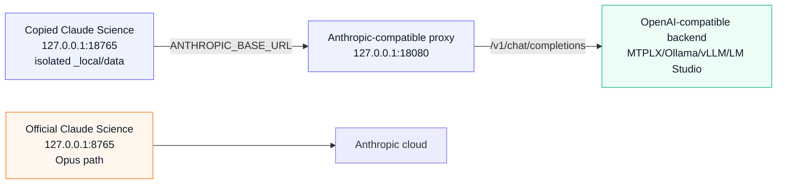

# Architecture

This lab keeps Claude Science itself intact and redirects only the model API
path for a copied, isolated instance.

## Proxy Surface

The proxy implements the small Anthropic surface Claude Science exercised in the
first proof:

- `GET /healthz`
- `GET /v1/models`
- `POST /v1/messages`
- `POST /v1/messages/count_tokens`

For `/v1/messages`, the proxy converts Anthropic Messages payloads into
OpenAI-compatible chat-completion payloads, forwards them to the configured
backend, then converts the response back into Anthropic Messages shape.

## Model Adaptation

Model-specific behavior belongs in profiles, not in Claude Science launch
logic. The MTPLX/Qwen profile is only the first known-good profile.

Useful profile dimensions:

- Model ID and base URL.
- Advertised Claude alias, usually `claude-opus-4-8`, plus the real local model.
- Request timeout.
- `max_tokens` cap.
- Stream mode: `direct` for true upstream SSE bridging or `buffered` for local
  backends that do not stream reliably.
- Tool mode: `pass` for tool-capable local models or `drop` for direct-analysis
  runs where Claude Science's tool schemas overwhelm the local model.
- Text-tool-call adaptation: Qwen can emit structured intentions as text, so the
  analysis profile can convert narrow patterns back into Anthropic `tool_use`
  blocks. Observed patterns currently covered by tests:
  - `<tool_call>["submit_output", "{\"verdict\":\"pass\"}"]`
  - `::submit_output::+json::{"verdict":"pass"}`
  - fenced JSON when Claude Science offered exactly one tool
  - `submit_output(verdict="pass", findings=[])`

## Main Technical Debt

The proxy can bridge true streaming, and the test suite covers streamed text,
streamed tool-call argument deltas, full-JSON fallback, and finite connection
close after `message_stop`. MTPLX/Qwen direct streaming hung during live testing,
so the MTPLX profiles intentionally use buffered mode.

The next reliability project is fresh-session reviewer verification across
several local models. Qwen's reviewer output is usable but model-specific enough
that adapters should remain profile-controlled.
