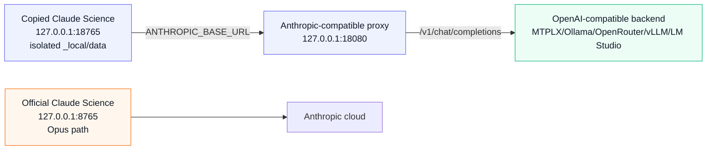

# Architecture

This lab keeps Claude Science itself intact and redirects only the model API
path for a copied, isolated instance.

## Proxy Surface

The proxy implements the small Anthropic surface Claude Science exercised in the
first proof:

- `GET /healthz`
- `GET /v1/models`
- `POST /v1/messages`
- `POST /v1/messages/count_tokens`

For `/v1/messages`, the proxy converts Anthropic Messages payloads into
OpenAI-compatible chat-completion payloads, forwards them to the configured
backend, then converts the response back into Anthropic Messages shape.

The proxy is being split along runtime boundaries rather than by cosmetic file
size. The first extracted modules are:

- `proxy/request_shape.py`: redacted Claude Science request-shape
  classification (`plain`, `tools_hidden`, `tool_agent`, `harness`).
- `proxy/observability.py`: redacted request IDs, counters, retry counts,
  provider latency summaries, and tool-filter reason counts.

The large conversion/server file still owns the Anthropic/OpenAI translation
state machine. Future splits should move that code only with matching tests.

## Agent And Harness Traffic

Claude Science does not run one monolithic conversation. In the observed local
database it creates separate frames for the foreground agent (`OPERON`) and
child reviewer frames (`REVIEWER`, `delegate_name=reviewer`). Future workflows
may add other delegate/subagent frames the same way. All of those frames call
the same configured Anthropic base URL, so the proxy must behave like a request
broker, not like a single-agent wrapper.

The proxy does not currently receive frame metadata such as `agent_name` in the
HTTP payload. It therefore classifies requests from payload shape:

- `harness`: structural app/reviewer tools such as `submit_output`.
- `tool_agent`: ordinary Claude Science tool turns forwarded to the local
  model.
- `tools_hidden`: Claude Science offered tools, but the active profile hid them
  from the local model.
- `plain`: no tools were offered.

Harness tools are configured separately with `PROXY_HARNESS_TOOLS`. This
matters because `submit_output` is not a user capability such as `bash`,
`python`, or `web_search`; it is the app's structured reviewer handshake.

Anthropic server-side tools are a separate boundary. Claude Science can offer
dated server tool entries such as `{type: "web_search_20250305", name:
"web_search"}` with no client input schema. In the current OpenAI-compatible
Chat Completions transport, the proxy must not translate those into OpenAI
function tools, because Claude Science will not execute them as ordinary agent
tools on the return path. With `PROXY_SERVER_WEB_SEARCH=tavily` or
`PROXY_SERVER_WEB_SEARCH=firecrawl`, the proxy can instead expose `web_search`
only to the upstream local model, execute the configured search backend itself
when the model calls that internal function, feed the results back into a
bounded upstream tool loop, and return Anthropic `server_tool_use` /
`web_search_tool_result` blocks to Claude Science. A future native Responses
provider could map the same boundary to an upstream hosted-search primitive.
Schema-bearing client tools named `web_search` still pass through if the app
ever offers one; the proxy-owned server bridge is only for Anthropic hosted
server-tool definitions.

Reviewer frames may also need inspection tools. In live Qwen runs, forwarding
only `submit_output` caused the reviewer to narrate or stall, because it wanted
to inspect saved TSV/Markdown/PNG artifacts. The proxy now preserves the
reviewer tool surface Claude Science offers instead of adding a separate
forwarding policy.

## Model Adaptation

Model-specific behavior belongs in profiles, not in Claude Science launch
logic. The MTPLX/Qwen profile is only the first known-good profile.

Useful profile dimensions:

- Model ID and base URL.
- Provider identity: `PROXY_PROVIDER_NAME` labels MTPLX, Ollama, OpenRouter, or
  a generic OpenAI-compatible backend in health output and logs without
  exposing credentials.
- Advertised Claude alias, usually `claude-opus-4-8`, plus the real local model.
- Display-name mapping: `PROXY_MODEL_DISPLAY_NAMES` controls the labels returned
  by `/v1/models`. Claude Science's `/api/models` route filters non-`claude-`
  IDs and slug-like lowercase display names, so the reliable local pattern is a
  Claude-shaped alias ID plus a human label such as `MTPLX Qwen 27B Local`.
- Request timeout.
- `max_tokens` cap.
- Stream mode: `direct` for true upstream SSE bridging or `buffered` for local
  backends that do not stream reliably.
- Direct-stream heartbeat interval: `PROXY_STREAM_HEARTBEAT_SECONDS` emits SSE
  comments during upstream idle gaps. This keeps the HTTP stream active without
  adding Anthropic content events. It is useful for providers that pause during
  long generation, but it does not by itself prove app-side tool-loop
  persistence.
- Tool mode: `pass` for tool-capable local models or `drop` when intentionally
  testing a no-tool proxy path. The default MTPLX/Qwen path uses `pass`, so it
  preserves Claude Science's app-pruned tool inventory. In pass mode, active
  tool definitions are translated losslessly from Anthropic `description` and
  `input_schema` into OpenAI-compatible `function.description` and
  `function.parameters`. The proxy does not trim, summarize, or rewrite active
  tool descriptions by default; context reduction should come from reducing or
  deferring which tools are active, not mutating the definitions that remain.
- Harness tools: `PROXY_HARNESS_TOOLS` are structural tools that bypass the
  normal foreground request handling, currently `submit_output` by default. If a
  request forwards exactly one harness tool, the proxy forces a named upstream
  `tool_choice` for that tool so reviewer calls do not devolve into prose.
- Tool validation: `schema` keeps Claude Science's offered tool schemas as the
  execution boundary. Returned tool calls are emitted only if the name was
  offered, arguments are a JSON object, and the object satisfies the advertised
  schema subset. `name` and `off` exist for debugging provider behavior.
- Tool repair: `metadata` can fill missing `human_description` fields before
  schema validation. This is intentionally limited to Claude Science's
  descriptive metadata field and does not repair semantic required inputs such
  as commands, code, file paths, environments, or artifact payloads.
- Python sanity filters reject observed malformed local model shapes such as
  `code` containing only an artifact filename, giant single-line import blobs,
  or Claude Science app-tool calls such as `skill({...})` smuggled into Python
  source.
- Mentioned-tool forcing: `PROXY_FORCE_MENTIONED_TOOL=1` maps explicit latest
  user wording such as "use/call/load the skill tool" or "call python to
  create..." to a named upstream `tool_choice`. It does not infer tools from
  topical words and is intended for focused debugging. When multiple
  tools are explicitly mentioned, the first explicit mention wins; this avoids
  forcing a later `save_artifacts` mention before the requested `python` call.
- Hidden-tool guard: when `drop` mode hides non-reviewer tool schemas, the proxy
  adds a system note telling the local model not to emit fake tool markup or
  claim searches, code execution, file reads, or artifact creation.
- Text-tool-call adaptation: Qwen can emit structured intentions as text, so the
  proxy can convert narrow patterns back into Anthropic `tool_use` blocks.
  Observed patterns currently covered by tests:
  - `<tool_call>["submit_output", "{\"verdict\":\"pass\"}"]`
  - `::submit_output::+json::{"verdict":"pass"}`
  - fenced JSON when Claude Science offered exactly one tool
  - `submit_output(verdict="pass", findings=[])`
  - `[submit_output](submit_output(verdict='fail', findings=[]))`
  - fenced reviewer JSON with preamble text, when `submit_output` is offered
  - fenced OpenAI-style function JSON such as
    `{"type":"function","name":"submit_output","arguments":{...}}`
  - XML-ish Qwen blocks such as
    `<tool_call><function=submit_output><parameter=verdict>pass</parameter>`
- Redacted schema capture: `PROXY_SCHEMA_LOG_PATH` writes JSONL inventories of
  offered tool names and schema shapes for later adapter work. It deliberately
  excludes prompts, outputs, full descriptions, and tool results.

## Observability

Every `/v1/messages` request receives a short `X-Request-Id` value. Proxy logs
use that request ID, and streamed/non-streamed responses include it as a
response header.

`GET /healthz` exposes only redacted operational metadata:

- Provider name, base URL, model, and whether optional provider attribution
  headers are configured.
- Request counters by request kind and stream mode.
- Provider latency summaries by request kind.
- Retry and upstream-error counts by HTTP status.
- Tool-call filter counts by reason, for example `unknown_tool`,
  `schema_invalid`, or `python_sanity`.
- Redacted optional debug-capture enablement markers, when configured.

It deliberately does not expose prompts, tool arguments, tool results, artifact
contents, cookies, account state, full debug-capture paths, or local app
database paths.

`PROXY_REQUEST_SHAPE_LOG_PATH` enables an ignored JSONL capture for redacted
request-size breakdowns. It records counts, schema sizes, and per-tool
definition JSON sizes, not prompt text.
`PROXY_RAW_REQUEST_CAPTURE_DIR` is a separate opt-in path for raw local request
captures and should be used only when the person running the lab explicitly
accepts that those files may contain proprietary app prompts and user data.

## Main Technical Debt

The proxy can bridge true streaming, and the test suite covers streamed text,
direct SSE heartbeats during upstream idle gaps, `X-Request-Id` response
headers, buffered validation of upstream streamed tool-call argument deltas,
invalid streamed tool filtering, full-JSON fallback, and finite connection
close after `message_stop`. Tool arguments are still emitted only after final
validation, not as unvalidated incremental app-visible deltas.

MTPLX/Qwen buffered mode is the current known-good app path for short tool
loops, but it can starve Claude Science of SSE events during long local
generations. Live figure probes showed the app can disconnect before a long
buffered response returns. MTPLX/Qwen direct mode has not yet produced a
verified persisted app-side tool loop, so it remains a development target rather
than the default profile.

The next reliability project is fresh-session reviewer verification across
several local models. Qwen's reviewer output is usable but model-specific enough
that adapters should remain configuration-controlled and regression-tested per model
family.

Full Claude Science execution additionally requires a local permission grant.
The UI path is "Permissions -> Allow -> for this conversation"; the scripted
equivalent is `scripts/resolve-input-request.py --scope conversation`. A real
workflow still needs persisted app `tool_result`, `execution_log`, artifact, and
reviewer evidence.
