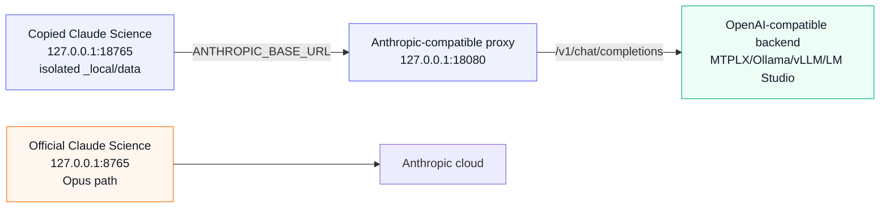

# Architecture

This lab keeps Claude Science itself intact and redirects only the model API
path for a copied, isolated instance.

## Proxy Surface

The proxy implements the small Anthropic surface Claude Science exercised in the
first proof:

- `GET /healthz`
- `GET /v1/models`
- `POST /v1/messages`
- `POST /v1/messages/count_tokens`

For `/v1/messages`, the proxy converts Anthropic Messages payloads into
OpenAI-compatible chat-completion payloads, forwards them to the configured
backend, then converts the response back into Anthropic Messages shape.

## Model Adaptation

Model-specific behavior belongs in profiles, not in Claude Science launch
logic. The MTPLX/Qwen profile is only the first known-good profile.

Useful profile dimensions:

- Model ID and base URL.
- Advertised Claude alias, usually `claude-opus-4-8`, plus the real local model.
- Request timeout.
- `max_tokens` cap.
- Future: provider-specific thinking/tool-call/JSON-mode hints.

## Main Technical Debt

The current proxy buffers streaming requests. Claude Science can consume the
synthetic Anthropic SSE response, but true incremental tool-call streaming will
be needed for reliability and speed on longer workflows.
