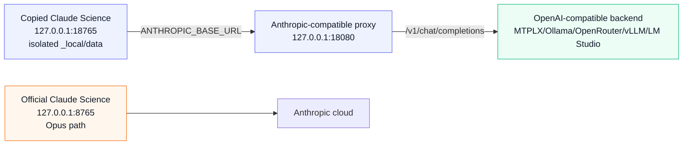

# Architecture

This lab keeps Claude Science itself intact and redirects only the model API
path for a copied, isolated instance.

## Proxy Surface

The proxy implements the small Anthropic surface exercised by observed Claude
Science traffic:

- `GET /healthz`
- `GET /v1/models`
- `POST /v1/messages`
- `POST /v1/messages/count_tokens`

For `/v1/messages`, the proxy converts Anthropic Messages payloads into
OpenAI-compatible chat-completion payloads, forwards them to the configured
backend, then converts the response back into Anthropic Messages shape.

The proxy is being split along runtime boundaries rather than by cosmetic file
size. The first extracted modules are:

- `proxy/request_shape.py`: redacted Claude Science request-shape
  classification (`plain`, `tools_hidden`, `tool_agent`, `harness`).
- `proxy/observability.py`: redacted request IDs, counters, retry counts,
  provider latency summaries, and tool-filter reason counts.

The large conversion/server file still owns the Anthropic/OpenAI translation
state machine. Future splits should move that code only with matching tests.

## Agent And Harness Traffic

Claude Science does not run one monolithic conversation. In the observed local
database it creates separate frames for the foreground agent (`OPERON`) and
child reviewer frames (`REVIEWER`, `delegate_name=reviewer`). Future workflows
may add other delegate/subagent frames the same way. All of those frames call
the same configured Anthropic base URL, so the proxy must behave like a request
broker, not like a single-agent wrapper.

The proxy does not currently receive frame metadata such as `agent_name` in the
HTTP payload. It therefore classifies requests from payload shape:

- `harness`: structural app/reviewer tools such as `submit_output`.
- `tool_agent`: ordinary Claude Science tool turns forwarded to the local
  model.
- `tools_hidden`: Claude Science offered tools, but the active profile hid them
  from the local model.
- `plain`: no tools were offered.

Harness tools are configured separately with `PROXY_HARNESS_TOOLS` and extend
the normal science-agent allowlist when present. This matters because
`submit_output` is not a user capability such as `bash`, `python`, or
`web_search`; it is the app's structured reviewer handshake. Treat reviewer
quality as model behavior unless a current trace proves a general transport
issue.

## Model Adaptation

Model-specific behavior belongs in profiles, not in Claude Science launch
logic. The MTPLX/Qwen profile is only the first known-good profile.

Useful profile dimensions:

- Model ID and base URL.
- Provider identity: `PROXY_PROVIDER_NAME` labels MTPLX, Ollama, OpenRouter, or
  a generic OpenAI-compatible backend in health output and logs without
  exposing credentials.
- Advertised Claude alias, usually `claude-opus-4-8`, plus the real local model.
- Display-name mapping: `PROXY_MODEL_DISPLAY_NAMES` controls the labels returned
  by `/v1/models`. Claude Science's `/api/models` route filters non-`claude-`
  IDs and slug-like lowercase display names, so the reliable local pattern is a
  Claude-shaped alias ID plus a human label such as `MTPLX Qwen 27B Local`.
- Request timeout.
- `max_tokens` cap.
- Stream mode: `direct` for true upstream SSE bridging or `buffered` for local
  backends that do not stream reliably.
- Direct-stream heartbeat interval: `PROXY_STREAM_HEARTBEAT_SECONDS` emits SSE
  comments during upstream idle gaps. This keeps the HTTP stream active without
  adding Anthropic content events. It is useful for providers that pause during
  long generation, but it does not by itself prove app-side tool-loop
  persistence.
- Tool mode: `pass` for tool-capable local models or `drop` for direct-analysis
  runs where Claude Science's tool schemas overwhelm the local model.
- Tool translation: only Claude client tools with a concrete `input_schema` are
  translated into OpenAI function tools. Native Anthropic server tools are not
  bridged by this proxy and must not be forwarded as fake functions.
- Tool allowlist: `PROXY_TOOL_ALLOWLIST` limits pass-through to task-relevant
  tools. Schema capture still records the full offered inventory, but the model
  only sees the allowlisted names and the response validator only accepts that
  same effective set.
- Harness tools: `PROXY_HARNESS_TOOLS` are structural tools that extend the
  normal allowlist, currently `submit_output` by default. The proxy translates
  Claude Science's explicit `tool_choice` when present, but it does not add a
  harness-specific `tool_choice` when the app did not request one. There is no
  separate reviewer-only tool surface in the proxy core; if a model needs a
  different tool inventory, record that as profile or evaluation evidence.
- Tool validation: `schema` keeps the forwarded client-tool schemas as the
  execution boundary. Returned tool calls are emitted only if the name survived
  forwarding, arguments are a JSON object, and the object satisfies the
  advertised schema subset. `name` and `off` exist for debugging provider
  behavior.
- Redacted schema capture: `PROXY_SCHEMA_LOG_PATH` writes JSONL inventories of
  offered tool names and schema shapes for later adapter work. It deliberately
  excludes prompts, outputs, full descriptions, and tool results.

## Observability

Every `/v1/messages` request receives a short `X-Request-Id` value. Proxy logs
use that request ID, and streamed/non-streamed responses include it as a
response header.

`GET /healthz` exposes only redacted operational metadata:

- Provider name, base URL, model, and whether optional provider attribution
  headers are configured.
- Request counters by request kind and stream mode.
- Provider latency summaries by request kind.
- Retry and upstream-error counts by HTTP status.
- Tool-call filter counts by reason, for example `unknown_tool` or
  `schema_invalid`.

It deliberately does not expose prompts, tool arguments, tool results, artifact
contents, cookies, account state, or local app database paths.

## Main Technical Debt

The proxy can bridge true streaming, and the test suite covers streamed text,
direct SSE heartbeats during upstream idle gaps, `X-Request-Id` response
headers, buffered validation of upstream streamed tool-call argument deltas,
invalid streamed tool filtering, full-JSON fallback, and finite connection
close after `message_stop`. Tool arguments are still emitted only after final
validation, not as unvalidated incremental app-visible deltas.

MTPLX/Qwen buffered mode is the current known-good app path for short tool
loops, but it can starve Claude Science of SSE events during long local
generations. Live app probes showed the app can disconnect before a long
buffered response returns. MTPLX/Qwen direct mode has not yet produced a
verified persisted app-side tool loop, so it remains a development target rather
than the default profile.

The next reliability project is fresh-session reviewer verification across
local and hosted OpenAI-compatible models. Model-specific adapters should stay
out of the proxy core until they have concrete transport-level evidence and
regression coverage.

Execution tools should be profiled separately from discovery/reviewer tools.
Direct isolated probes on Qwen 27B succeeded for `python` and `save_artifacts`
when the foreground tool surface was narrow, but model mistakes should remain
visible as model mistakes.
Full Claude Science execution additionally requires a local permission grant.
The UI path is "Permissions -> Allow -> for this conversation"; the scripted
equivalent is `scripts/resolve-input-request.py --scope conversation`. A real
workflow still needs persisted app `tool_result`, `execution_log`, artifact, and
reviewer evidence.
