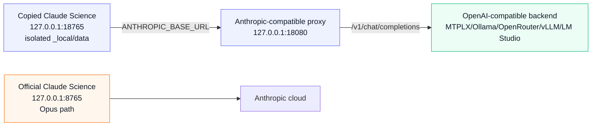

# Architecture

This lab keeps Claude Science itself intact and redirects only the model API
path for a copied, isolated instance.

## Proxy Surface

The proxy implements the small Anthropic surface Claude Science exercised in the
first proof:

- `GET /healthz`
- `GET /v1/models`
- `POST /v1/messages`
- `POST /v1/messages/count_tokens`

For `/v1/messages`, the proxy converts Anthropic Messages payloads into
OpenAI-compatible chat-completion payloads, forwards them to the configured
backend, then converts the response back into Anthropic Messages shape.

## Agent And Harness Traffic

Claude Science does not run one monolithic conversation. In the observed local
database it creates separate frames for the foreground agent (`OPERON`) and
child reviewer frames (`REVIEWER`, `delegate_name=reviewer`). Future workflows
may add other delegate/subagent frames the same way. All of those frames call
the same configured Anthropic base URL, so the proxy must behave like a request
broker, not like a single-agent wrapper.

The proxy does not currently receive frame metadata such as `agent_name` in the
HTTP payload. It therefore classifies requests from payload shape:

- `harness`: structural app/reviewer tools such as `submit_output`.
- `tool_agent`: ordinary Claude Science tool turns forwarded to the local
  model.
- `tools_hidden`: Claude Science offered tools, but the active profile hid them
  from the local model.
- `plain`: no tools were offered.

Harness tools are configured separately with `PROXY_HARNESS_TOOLS` and bypass
the normal science-agent allowlist. This matters because `submit_output` is not
a user capability such as `bash`, `python`, or `web_search`; it is the app's
structured reviewer handshake. A focused Qwen profile can safely expose
`submit_output` to reviewer frames while still restricting the foreground agent
to a small science-tool subset.

## Model Adaptation

Model-specific behavior belongs in profiles, not in Claude Science launch
logic. The MTPLX/Qwen profile is only the first known-good profile.

Useful profile dimensions:

- Model ID and base URL.
- Advertised Claude alias, usually `claude-opus-4-8`, plus the real local model.
- Display-name mapping: `PROXY_MODEL_DISPLAY_NAMES` controls the labels returned
  by `/v1/models`. Claude Science's `/api/models` route filters non-`claude-`
  IDs and slug-like lowercase display names, so the reliable local pattern is a
  Claude-shaped alias ID plus a human label such as `MTPLX Qwen 27B Local`.
- Request timeout.
- `max_tokens` cap.
- Stream mode: `direct` for true upstream SSE bridging or `buffered` for local
  backends that do not stream reliably.
- Tool mode: `pass` for tool-capable local models or `drop` for direct-analysis
  runs where Claude Science's tool schemas overwhelm the local model.
- Tool allowlist: `PROXY_TOOL_ALLOWLIST` limits pass-through to task-relevant
  tools. Schema capture still records the full offered inventory, but the model
  only sees the allowlisted names and the response validator only accepts that
  same effective set.
- Harness tools: `PROXY_HARNESS_TOOLS` are structural tools that bypass the
  normal allowlist, currently `submit_output` by default. If a request forwards
  exactly one harness tool, the proxy forces a named upstream `tool_choice` for
  that tool so reviewer calls do not devolve into prose.
- Tool validation: `schema` keeps Claude Science's offered tool schemas as the
  execution boundary. Returned tool calls are emitted only if the name was
  offered, arguments are a JSON object, and the object satisfies the advertised
  schema subset. `name` and `off` exist for debugging provider behavior.
- Tool repair: `metadata` can fill missing `human_description` fields before
  schema validation. This is intentionally limited to Claude Science's
  descriptive metadata field and does not repair semantic required inputs such
  as commands, code, file paths, environments, or artifact payloads.
- Mentioned-tool forcing: `PROXY_FORCE_MENTIONED_TOOL=1` maps explicit latest
  user wording such as "use/call/load the skill tool" or "call python to
  create..." to a named upstream `tool_choice`. It does not infer tools from
  topical words and is intended for focused Qwen probe profiles. When multiple
  tools are explicitly mentioned, the first explicit mention wins; this avoids
  forcing a later `save_artifacts` mention before the requested `python` call.
- Hidden-tool guard: when `drop` mode hides non-reviewer tool schemas, the proxy
  adds a system note telling the local model not to emit fake tool markup or
  claim searches, code execution, file reads, or artifact creation.
- Text-tool-call adaptation: Qwen can emit structured intentions as text, so the
  analysis profile can convert narrow patterns back into Anthropic `tool_use`
  blocks. Observed patterns currently covered by tests:
  - `<tool_call>["submit_output", "{\"verdict\":\"pass\"}"]`
  - `::submit_output::+json::{"verdict":"pass"}`
  - fenced JSON when Claude Science offered exactly one tool
  - `submit_output(verdict="pass", findings=[])`
  - `[submit_output](submit_output(verdict='fail', findings=[]))`
  - fenced reviewer JSON with preamble text, when `submit_output` is offered
  - fenced OpenAI-style function JSON such as
    `{"type":"function","name":"submit_output","arguments":{...}}`
  - XML-ish Qwen blocks such as
    `<tool_call><function=submit_output><parameter=verdict>pass</parameter>`
- Redacted schema capture: `PROXY_SCHEMA_LOG_PATH` writes JSONL inventories of
  offered tool names and schema shapes for later adapter work. It deliberately
  excludes prompts, outputs, full descriptions, and tool results.

## Main Technical Debt

The proxy can bridge true streaming, and the test suite covers streamed text,
buffered validation of streamed tool-call argument deltas, invalid streamed tool
filtering, full-JSON fallback, and finite connection close after
`message_stop`. MTPLX/Qwen buffered mode is the current known-good app path for
short tool loops, but it can starve Claude Science of SSE events during long
local generations. Live figure probes showed the app can disconnect before a
long buffered response returns. MTPLX/Qwen direct mode has not yet produced a
verified persisted app-side tool loop, so it remains a development target rather
than the default profile.

The next reliability project is fresh-session reviewer verification across
several local models. Qwen's reviewer output is usable but model-specific enough
that adapters should remain profile-controlled and regression-tested per model
family.

Execution tools should be profiled separately from discovery/reviewer tools.
Direct isolated probes on Qwen 27B succeeded for `python` and `save_artifacts`
when the execution profile exposed only those tools and forced the named tool.
Full Claude Science execution additionally requires a local permission grant.
The UI path is "Permissions -> Allow -> for this conversation"; the scripted
equivalent is `scripts/resolve-input-request.py --scope conversation`. A real
workflow still needs persisted app `tool_result`, `execution_log`, artifact, and
reviewer evidence.
