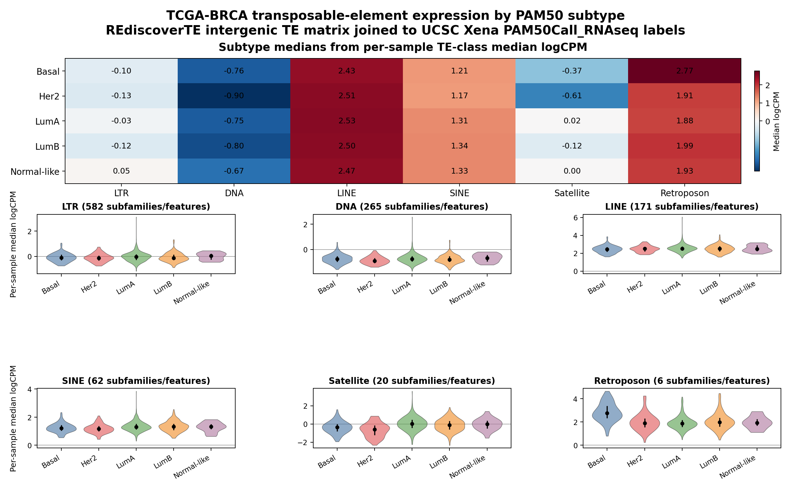

# BRCA TE Subtype Quick Look

This note records the current public-data route for a quick TCGA-BRCA
transposable-element expression plot without reprocessing FASTQ or BAM files.

## Why The Earlier STOP Was Not Definitive

The bounded OpenRouter/Nemotron smoke that returned:

```text
STOP: closest reusable public source found, but missing what is needed for the requested BRCA subtype TE plot.
```

was a useful web-search bridge test, not a valid final data-availability
conclusion. Proxy and request-shape logs show Claude Science offered the normal
foreground tool surface, including `search_skills`, `skill`, and proxy-owned
`web_search`, and the run stopped after the configured Firecrawl search budget.

So the right interpretation is:

- The proxy made the tools available.
- The free OpenRouter route used Firecrawl and stopped cleanly at the configured
  search budget.
- The model did not complete the domain discovery under that bounded smoke
  prompt.
- This does not prove that the data are unavailable.

## Model Discovery Status

The reproducible path below should be treated as the reliable route, not as
something current free/local models are guaranteed to rediscover from scratch.

- OpenRouter / Nemotron free-route test: the proxy route worked, `search_skills`
  was available, and Firecrawl search was exercised, but the model returned the
  bounded `STOP` answer above. The skill search results did not include a
  TE-specific data recipe, and Firecrawl did not surface REdiscoverTEdata/Xena
  in the limited search budget.
- MTPLX / Qwen local test: the app foreground request exposed 25 tools and the
  proxy started the server-tool loop. The run failed at the configured 240 s
  upstream timeout before Claude Science received a final answer. The MTPLX log
  shows that Qwen attempted relevant searches, including REdiscoverTE, and later
  produced a `READY`-like preview, but the preview was not delivered to the app
  and appears to conflate Xena with the TE matrix. That is not clean evidence of
  successful autonomous discovery.
- Current conclusion: this is a domain-recipe/catalog gap more than a proxy
  routing gap. If we expect smaller local/free models to solve this reliably, the
  Claude Science skill catalog should include a concrete BRCA/TCGA TE recipe
  that points to REdiscoverTEdata for TE expression and UCSC Xena for PAM50
  labels, or the user prompt should explicitly provide this notebook/path.

## Public Data Route

Use two public sources:

1. REdiscoverTE / REdiscoverTEdata
   - Paper: <https://www.nature.com/articles/s41467-019-13035-2>
   - Data package:
     <http://research-pub.gene.com/REdiscoverTEpaper/data/REdiscoverTEdata_1.0.1.tar.gz>
   - The package contains
     `REdiscoverTEdata/inst/Fig4_data/eset_TCGA_TE_intergenic_logCPM.RDS`.
   - The RDS is a Biobase `ExpressionSet` with intergenic TE logCPM values and
     feature metadata columns `repName`, `repClass`, and `repFam`.

2. UCSC Xena TCGA-BRCA clinical matrix
   - Metadata URL:
     <https://tcga.xenahubs.net/download/TCGA.BRCA.sampleMap/BRCA_clinicalMatrix>
   - This matrix includes `PAM50Call_RNAseq`, `PAM50_mRNA_nature2012`, and
     `Integrated_Clusters_with_PAM50__nature2012`.

The quick-look notebook joins REdiscoverTE sample barcodes to Xena sample IDs
with the first 15 TCGA barcode characters, keeps primary BRCA tumors
(`sample type 01`), and uses `PAM50Call_RNAseq` for the first-pass subtype
label because it has broader coverage than `PAM50_mRNA_nature2012` in this
matrix.

Observed local run counts:

- REdiscoverTE matrix: 1,204 TE/RE features by 7,353 TCGA samples.
- BRCA samples in the matrix: 1,095.
- BRCA primary tumors: 982.
- Primary tumors matched to Xena clinical metadata: 982.
- Xena clinical primary tumors with `PAM50Call_RNAseq`: 844.
- Joined REdiscoverTE + Xena primary tumors with `PAM50Call_RNAseq`: 834.
- Joined PAM50 sample counts: Basal 137, Her2 67, LumA 415, LumB 192,
  Normal-like 23.

Provenance checksums from the local reproducibility run:

- `REdiscoverTEdata_1.0.1.tar.gz`:
  `a4dda87737fb95c170552c50c85e7a8f0c2eb1d2ab25e0816fc5376e0fd32d04`
- `eset_TCGA_TE_intergenic_logCPM.RDS`:
  `c34775400a85d425936dd303986b67eb071422b648aa5d64b70cd7e5cb71d4b3`
- `BRCA_clinicalMatrix.tsv`:
  `822db81a4f345a455bf9d26bea59423761828ef60bfc2213e335e6351bfc6e1c`

## Plot

The notebook summarizes each sample by the median logCPM across features in a
cleaned `repClass` group, then plots six interpretable classes:

- `LTR`
- `DNA`
- `LINE`
- `SINE`
- `Satellite`
- `Retroposon`



## Initial Interpretation

This is a quick-look class-level summary, not a differential-expression claim.
In the current run, the clearest subtype-scale separation is in `Retroposon`,
where Basal tumors show higher per-sample class-median expression than the
other PAM50 groups. `Satellite` and `DNA` show smaller subtype shifts. `LINE`,
`SINE`, and `LTR` are comparatively stable at this coarse class-median level.

The next biological pass should move from class medians to subfamily-level
statistics, because a class-level median can hide specific TE subfamilies that
drive a subtype signal.

## Caveats Before A Release Claim

- This route does not reprocess raw sequencing data; it reuses the
  REdiscoverTEdata precomputed intergenic TE matrix.
- The expression values are logCPM values from the REdiscoverTE workflow, not
  generic gene-expression TPMs.
- `PAM50Call_RNAseq` is used for label coverage. The Nature 2012 mRNA subtype
  column is available but labels fewer samples.
- The `Normal-like` label is a PAM50 tumor subtype label, not normal tissue.
  Normal tissue samples were excluded from the subtype plot.
- The first plot summarizes `repClass` groups by per-sample medians. It is
  appropriate for orientation, but not enough for a claim about individual
  TE subfamilies.
- This is not a statistical differential-expression test. It does not correct
  for batch effects, tumor purity, immune infiltration, receptor status, or
  multiple testing.
- The subtype groups are imbalanced, especially Her2 (67 samples) and
  Normal-like (23 samples).
- OpenRouter-free model evidence is still per-route and per-moment. The current
  Nemotron free-route discovery test proves the proxy can route and use
  Firecrawl under that model, but the model did not find the REdiscoverTEdata +
  Xena route under a bounded prompt.
- MTPLX/Qwen has a clean pinned-data workflow proof for TP53. The current TE
  discovery test exposed the expected tool surface but failed on upstream
  timeout, so the TE subtype workflow still needs a fresh app-side proof using
  this notebook or a similarly explicit prompt.

## Reproducible Notebook

Prerequisites:

- Python with the packages in `requirements-analysis.txt`.
- `Rscript` on `PATH`. The notebook installs `BiocManager` and `Biobase` into
  `_local/cache/brca_te/r-lib/` if they are missing.

Run:

```bash
python3 -m pip install -r requirements-analysis.txt
jupyter notebook examples/brca_te_subtype_rediscovertre_analysis.ipynb
```

The notebook writes downloads, local R packages, intermediate CSV files, and
generated plots under `_local/cache/brca_te/`, which is ignored by git. It also
updates the checked-in preview image at
`docs/assets/brca-te-subtype-heatmap-violin.png` so the README/doc asset can be
reproduced from the notebook.
