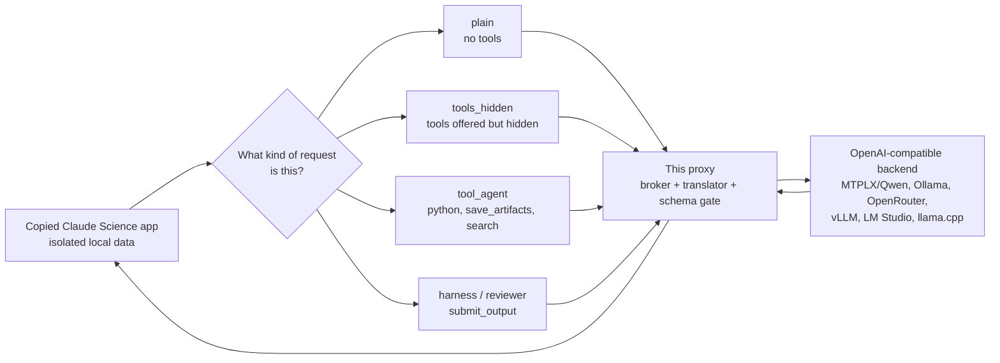

# Why This Proxy Exists

Most Claude Code proxies translate one chat/tool loop from an
Anthropic-shaped client to another model provider. Claude Science is a
different target.

In observed runs, Claude Science sends several kinds of model requests through
the same Anthropic-compatible API path: foreground analysis, hidden helper
calls, tool-agent turns, and reviewer/harness checks. This proxy exists to
preserve those shapes while letting the model backend be local or
OpenAI-compatible.

That matters for three practical reasons:

- **Portability:** teams should be able to test local, open, or hosted models
  without giving up the Claude Science workbench.
- **Governance:** sensitive prompts, intermediate hypotheses, code, and
  artifacts may need a private/local route.
- **Cost optionality:** routine loops, reviewer passes, retries, and figure
  iteration should not have to inherit one vendor's pricing curve.

## The Shape Difference



The important part is the middle box. The proxy is not just swapping URLs. It
records the request shape for observability, applies the profile's configured
tool policy, validates returned tool calls, and converts responses back into the
Anthropic Messages shape that Claude Science expects. Classification itself does
not select a different tool surface.

## What The Proxy Adds

| Area | What it does |
| --- | --- |
| App isolation | Runs a copied Claude Science app against `_local/` data so the official app and account state stay untouched. |
| Request-shape classification | Labels `plain`, `tools_hidden`, `tool_agent`, and `harness` traffic for redacted logs and metrics. |
| Reviewer safety | Keeps structural reviewer tools such as `submit_output` explicit without adding reviewer-only rescue policy. |
| Tool correctness | Validates returned tool calls against the effective forwarded client-tool schemas before emitting executable `tool_use`. |
| Local-model adaptation | Keeps model-specific behavior in provider profiles and validates executable tool calls at the schema boundary. |
| Provider portability | Supports MTPLX/Qwen, Ollama, OpenRouter, and generic OpenAI-compatible backends through profiles. |
| Model picker clarity | Profiles can advertise Claude-shaped aliases with human display names such as `MTPLX Qwen 27B Local` when the app needs them. |
| Public-safe evidence | Logs redacted request IDs, request-kind counters, latency, retry counts, and tool-filter reasons without prompts or artifacts. |
| Regression coverage | Tests streaming, heartbeat comments, schema validation, invalid tool filtering, request IDs, health metrics, and allowlist behavior. |

## What Makes It Different From A Claude Code Proxy

A traditional Claude Code proxy can often get pretty far by translating:

```text
Anthropic message -> OpenAI chat completion -> Anthropic message
```

Claude Science needs more care because reviewer and tool calls are part of the
product workflow. A failed reviewer `submit_output`, a hidden-tool call treated
as a foreground agent, or a local model hallucinating a Python/artifact call can
break the scientific session even if ordinary chat still works.

This repo records Claude Science request kind as an observability abstraction.
Provider selection, stream mode, tool forwarding, and validation remain explicit
profile or request settings; classification does not silently change them.

## Where Other Projects Are Better

This repo is intentionally narrow. Other proxies may be better if you need:

- Broad Claude Code provider coverage.
- Rich ReAct/XML fallback modes.
- Image modes or multimodal gateway features.
- Account management, billing, dashboards, or automatic fallback routing.
- Mature provider-specific streaming infrastructure.

This project borrows ideas from prior Claude Code proxies, but its reason to
exist is Claude Science workflow compatibility.

## What This Is Not

- It is not a Claude Science subscription or entitlement bypass.
- It does not redistribute Claude Science or Anthropic proprietary files.
- It is not a universal Claude Code replacement.
- It is not a claim that local models match Claude Opus on scientific quality.
- It does not remove the need for expert scientific review.

## Design Direction

The right future direction is to keep the Claude Science compatibility
behavior sharp while gradually modularizing:

- request-shape classification;
- provider transport;
- streaming;
- tool/schema validation;
- observability;
- provider/profile settings.

In short: preserve the Claude Science workbench experience, but make the model
backend replaceable, inspectable, and easier to govern.
